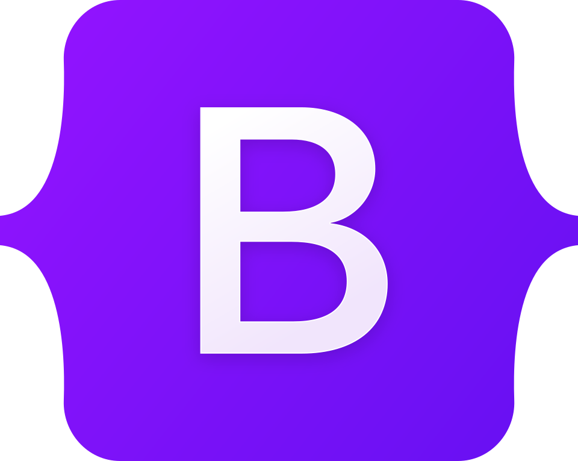

	

<h1 align="center">¡Hola! Soy Humberto 👋</h1>

<h3 align="center">Desarrollador de Software y estudiante de Ingeniería en Sistemas (ESCOM-IPN) 🇲🇽</h3>

  

### 

Me gusta construir cosas geniales, resolver problemas y aprender en el proceso. Aquí tienes un resumen de lo que hago:

- 🎓 Estudiante de Ingeniería en Sistemas Computacionales en **ESCOM - IPN**.
- 💻 Desarrollador enfocado en construir herramientas efectivas y escalables.
- ☁️ Trabajando fuertemente con el **ecosistema de Salesforce** (Agentforce, Data Cloud) y arquitecturas en la nube.
- 🌱 Siempre buscando mejorar mi stack e integrar nuevas tecnologías a mi flujo de trabajo.

### 💡Idiomas:

<table  align="center">
  <tr>
    <td>
		🇲🇽 Español - Nativo
	</td>
  </tr>

  <tr>
    <td>
		🇪🇺 English - Intermediate
    </td>
  </tr>
</table>

<h2 align="center">Mi stack preferido para construir algo es: PERN</h2>

  
	
	
	
	
	

<h3 align="center">🚀 Lenguajes:</h3>

<table align="center">
  <tr>
    <td></td>
    <td></td>
    <td></td>
		<td></td>
		<td></td>
		<td></td>
		<td></td>
  		<td></td>
		<td></td>
  </tr>
</table>

###
<h3 align="center">📦 Frameworks y Librerías (PERN Stack & More):</h3>

<table align="center">
  <tr>
    <td>
  		
		</td>
	<td>
		
	</td>
	<td>
  	
	</td>
	<td>
  	 
		</td>
  <td>
		
	</td>
  <!-- PERN al principio -->
	<td>
  
	</td>
	<td>
  
	</td>
	<td>
  
	</td>
	<td>
  
	</td>
</table>

<h3 align="center">🛠️ Herramientas y Nube:</h3>

<table align="center">
	<tr>
		<td>
  
		</td>
		<td>
  
		</td>
		<td>
  
	
  
	
  
	
  
	
  
	
  
	
  
		</td>
	</tr>
</table>

 

<h3 align="center">📈 Mis Estadísticas:</h3>

  

 

  
 

 
